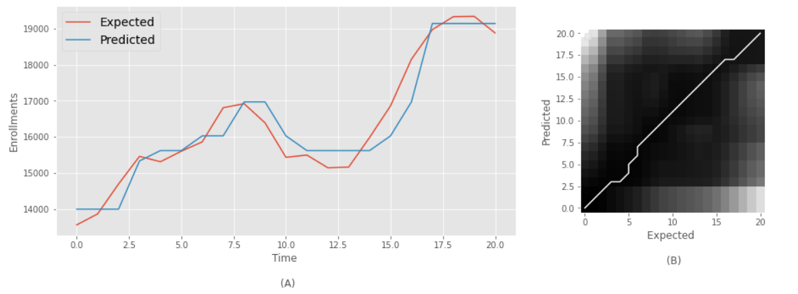

# Filtered Fuzzy Time Series
This project brings a new fuzzy time series model for the task of regression in time series that have great influences of stochastic components. The developed model was compared with the state of the art and achieved superior results. For more information, see the article [Using fuzzy clustering to address imprecision and uncertainty present in deterministic components of time series](xxx).

The main contribution of this work is focused on automatically modeling the fuzzification stage, by pre-processing the series, and eliminating noise and components of high frequency with low information. Next, we show an application of our model in the financial series TAIEX 1992 (A), and the resultant plot from the DTW metric to exemplify the alignment of the expected series and the predicted one (B).


### Illustrative Example

#### Decomposition with Empirical Mode Decomposition (EMD)

```python
# decomposition: apply EMD to get IMFs
emd = EMD()
imfs = emd.emd(time_series)
```


### Select deterministic components

```python
# Select MFIs without trending and noise behavior 
deterministic_time_series = imfs[1]+imfs[2]
```


#### Apply in model to fit and forecasting

```python
from FTS.Models.MV_Chen import STFMV_Convencional_Chen

fuzzy_sets = 7

model = STFMV_Convencional_Chen()
model.fit(X=[[time_series, deterministic_time_series]], k=fuzzy_sets)
model.predict()
```





## Run

The project already comes with a configured environment and can be run with `docker` and `make:`

 -  Clone: `git clone https://github.com/Marcos001/Filtered-Fuzzy-Time-Series.git`
 -  Run: 
     -  `make run` (init container docker with project folder and data)
     -  `make vlogs`
         -  acess URL generate in logs of container docker: `http://127.0.0.1:8888/lab?token=...`

### Project structure

- **F-fts/**
  - **data/**: datasets used;
  - **FTS/** : library with created model and state-of-the-art methods;
  - **index.R**: Validation index used to estimate amount fuzzy sets;
  - **EstimeAmountFuzzySets.ipynb**: Estimate amount fuzzy sets with validation index;
  - **IlustrativeExample.ipynb**: Example how to run the proposed model in the series used in the state of the art;
  - **QE-Grid_Search_Alabama.ipynb**: Grid search to estimate amount fuzzy sets  in time series enrollments of Alabama;
  - **QE-Grid_Search_DAX.ipynb** Grid search to estimate amount fuzzy sets in time series Dax sock index;
  - **QE-Grid_Search_TAIEX_1992.ipynb**:  Grid search to estimate amount fuzzy sets in time series TAIEX 1992 sock index;
  - **State_Art_Alabama.ipynb**: Proposed method and state of the art applied to alabama enrollment series;
  - **State_Art_DAX.ipynb**: Proposed method and state of the art applied to DAX stock index serie;
  - **State_Art_TAIEX_1992.ipynb** Proposed method and state of the art applied to TAIEX 1992 stock index serie

### Contact

Work developed by researchers: Marcos Vinícius dos Santos Ferreira (marcosvsf@ufba.br), Ricardo Rios (ricardoar@ufba.br), Tatiane Rios (tatiane.nogueira@ufba.br) and Rodrigo Mello mello@icmc.usp.br).

